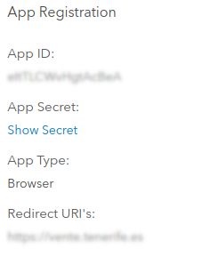

# Wordpress

Blog para gestores de Vente

## Instalación
Hacer la instalación en / y luego mover todo el contenido a la carpeta /blog. 
Una vez movido el contenido es necesario crear un fichero en / con nombre .htaccess con el siguiente contenido.

```
<IfModule mod_rewrite.c>
RewriteEngine on
RewriteCond %{HTTP_HOST} ^(www.)?vente.tenerife.es$
RewriteCond %{REQUEST_URI} !^/blog/
RewriteCond %{REQUEST_FILENAME} !-f
RewriteCond %{REQUEST_FILENAME} !-d
RewriteRule ^(.*)$ /blog/$1
RewriteCond %{HTTP_HOST} ^(www.)?vente.tenerife.es$
RewriteRule ^(/)?$ blog/index.php [L] 
</IfModule>

php_value upload_max_filesize 256M
```

## Login contra Portal for ArcGIS

### Portal for ArcGIS

Para permitir autenticar los usuarios contra el sistema de autentificación de la plataforma ArcGIS es necesario seguir los siguientes pasos. Lo primero que hay que hacer es registrar la aplicación dentro del Portal for ArcGIS, para ello es necesario ir a Content y a continuación a Add an application, se mostrará el siguiente cuadro de diálogo.


Una vez creada la aplicación es necesario generar el App Client y Secret Client, para ello dentro de la ficha descriptiva de la aplicación creada, hay que hacer click en Settings.


Dentro de la pestaña “Settings” se encuentran los parámetros de configuración.


Una vez pulsado el botón Register se abre un pop-up donde introducir las rutas válidas desde las que se puede acceder al registro, en este caso, es solo el blog.


Una vez registrada aparecerá el App ID (Client ID) y App Secret (Client Secret) necesarios para usarlos de el plugin de login del wordpress.



### Wordpress

Instalar el plugin miniOrange OpenID Connect y una vez activado e instalado acceder a la configuración.


Se elige la opción de añadir custom Configuration Oauth Provider.


Una vez configurado y creado, se puede testear la configuración del plugin desde la propia pantalla pulsando en el botón “Test Configuration”, se abrirá un pop-up con el login del Portal de ArcGIS, esto significa que la dirección al Authorize endpoint es correcta.


Una vez logeado con las credenciales de un usuario del portal se mostrará una tabla como la de a continuación, donde se exponen todos los atributos reportados del usuario.


Por último, es necesario configurar el atributo Username desde la pestaña Attribute/Role Mapping.


#### Comprobando funcionamiento
Para comprobar el funcionamiento del login, accedemos al siguiente enlace [https://vente.tenerife.es/blog/wp-login.php](https://vente.tenerife.es/blog/wp-login.php)


Haciendo click en el botón Login with Vente se accederá a la ventana de acceso para acceder mediante el Portal for ArcGIS.


Una vez accedemos a la aplicación, aparece en la barra superior derecha el nombre del usuario.


## Backup

Conectarse al minio.

```bash
mc alias set minio https://minio.vente.tenerife.int
```

Creación del usuario.

```bash
mc admin user add minio wp-backup-user
mc admin group add minio wp-backup-group wp-backup-user
```

Crear un fichero wp-backup-policy.json

```bash
{
    "Version": "2012-10-17",
    "Statement": [
        {
            "Effect": "Allow",
            "Action": [
                "s3:GetBucketLocation",
                "s3:ListBucket",
                "s3:ListBucketMultipartUploads"
            ],
            "Resource": [
                "arn:aws:s3:::wp-backups"
            ]
        },
        {
            "Effect": "Allow",
            "Action": [
                "s3:AbortMultipartUpload",
                "s3:DeleteObject",
                "s3:DeleteObjectVersion",
                "s3:GetObject",
                "s3:GetObjectVersion",
                "s3:PutObject"
            ],
            "Resource": [
                "arn:aws:s3:::wp-backups/*"
            ]
        },
        {
            "Effect": "Allow",
            "Action": [
                "s3:ListAllMyBuckets"
            ],
            "Resource": [
                "arn:aws:s3:::*"
            ]
        }
    ]
}
```

Crear política de acceso al bucket.

```bash
mc admin policy add minio wp-backup-policy wp-backup-policy.json
```

Se aplican las políticas al grupo.

```bash
mc admin policy set minio wp-backup-policy group=wp-backup-group
```

Se crea el bucket.

```bash
mc mb minio/wp-backups --insecure
```

Aplica política de retención de backups 2 días.

```bash
mc ilm import minio/wp-backups --insecure <<EOF
{
  "Rules": [
   {
    "Expiration": {
     "Days": 2
    },
    "ID": "deleteOldBackups",
    "Status": "Enabled"
   }
  ]
}
EOF
```